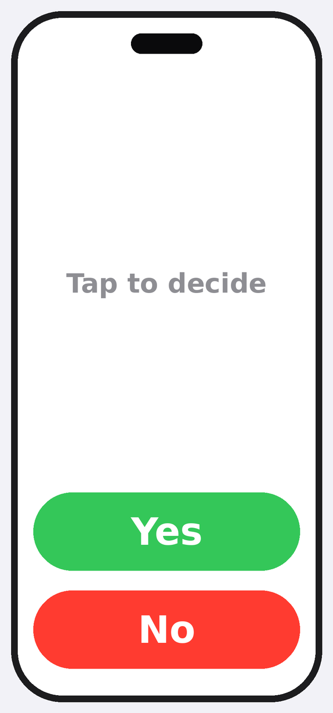
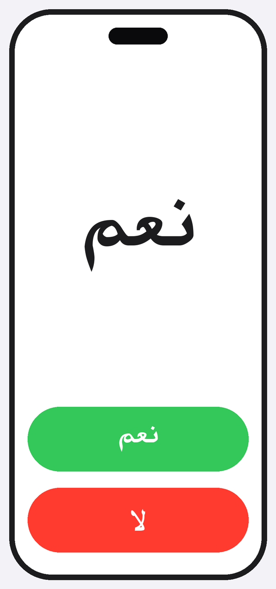
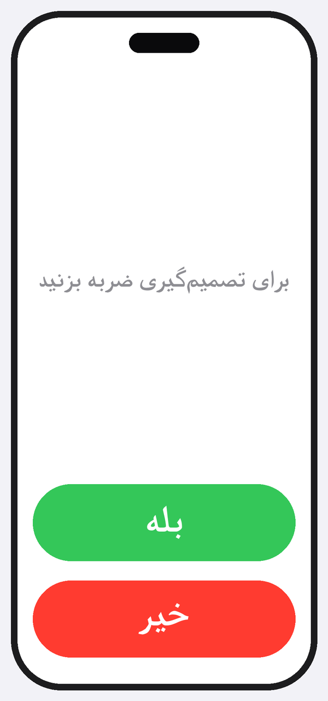
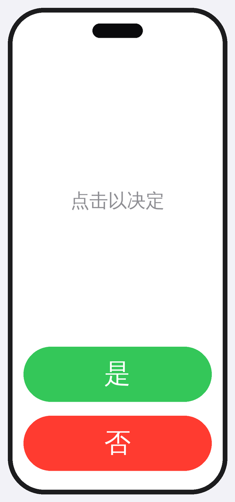

# Yes / No

A deliberately tiny iOS app: one screen, two buttons — **Yes** and **No** — with
a small "Tap to decide" prompt and haptic feedback on tap. That's the whole app.

What sets it apart is **broad internationalization**, including right-to-left
languages. Every piece of user-facing text — the buttons, the prompt, and even
the Home Screen app name — is fully localized, and the layout flips automatically
for RTL languages. Most existing App Store "Yes/No" apps don't lead with this.

## Screenshots

| English (`en`) | Arabic (`ar`, RTL) | Persian (`fa`, RTL) | Simplified Chinese (`zh-Hans`) |
| :---: | :---: | :---: | :---: |
|  |  |  |  |
| Initial prompt | Result after tapping **Yes** | Initial prompt | Initial prompt |

> These are design renders of the exact screen the SwiftUI code produces (same
> system colors, capsule buttons, and localized strings), generated by
> [`docs/make_screenshots.py`](docs/make_screenshots.py) — not iOS Simulator
> captures. For real App Store screenshots, run the app in Xcode and capture
> from the Simulator (⌘S). Note how Arabic and Persian mirror right-to-left
> automatically.

## Supported languages

| Language            | Code      | Yes  | No    | Prompt                          | App name      |
| ------------------- | --------- | ---- | ----- | ------------------------------- | ------------- |
| English (source)    | `en`      | Yes  | No    | Tap to decide                   | Yes / No      |
| Dutch               | `nl`      | Ja   | Nee   | Tik om te kiezen                | Ja / Nee      |
| Arabic (RTL)        | `ar`      | نعم  | لا    | اضغط لتقرر                       | نعم / لا       |
| Persian / Farsi (RTL)| `fa`     | بله  | خیر   | برای تصمیم‌گیری ضربه بزنید        | بله / خیر      |
| Spanish             | `es`      | Sí   | No    | Toca para decidir               | Sí / No       |
| French              | `fr`      | Oui  | Non   | Touchez pour décider            | Oui / Non     |
| German              | `de`      | Ja   | Nein  | Zum Entscheiden tippen          | Ja / Nein     |
| Simplified Chinese  | `zh-Hans` | 是   | 否    | 点击以决定                       | 是 / 否        |

Arabic and Persian render right-to-left automatically — there is no RTL-specific
code. SwiftUI mirrors the layout based on the active locale.

## Requirements

- **Xcode 16** or later (the project uses `objectVersion = 77` and a
  file-system synchronized root group).
- **iOS 16.0+** deployment target.
- A Mac to build and run.

## Build & run

1. Open `YesNo.xcodeproj` in Xcode 16.
2. Select the **YesNo** scheme and an iOS 16+ simulator (or a device).
3. Press **Run** (⌘R).

### Trying other languages

The fastest way to preview a localization without changing your device
settings:

- **Simulator/device:** Settings → General → Language & Region → add the
  language and move it to the top.
- **Xcode scheme:** Product → Scheme → Edit Scheme → **Run** → **Options** →
  **App Language**, then pick a language (e.g. *Arabic* or *Persian* to see the
  right-to-left layout).

## How localization is wired up

All strings live in **Apple String Catalogs** (`.xcstrings`):

- `YesNo/Localizable.xcstrings` — the in-app strings: `Yes`, `No`,
  `Tap to decide`.
- `YesNo/InfoPlist.xcstrings` — `CFBundleDisplayName`, the Home Screen app name.

Relevant build settings:

- `SWIFT_EMIT_LOC_STRINGS = YES` — Xcode extracts localizable strings from code.
- `GENERATE_INFOPLIST_FILE = YES` with `INFOPLIST_KEY_CFBundleDisplayName` —
  the generated Info.plist picks up the localized app name from
  `InfoPlist.xcstrings`.
- `knownRegions` in the project lists every supported language.

In code, strings are referenced as `LocalizedStringKey` literals (e.g.
`Text("Tap to decide")`), so the catalog resolves them at runtime.

## How to add a language

1. Open `YesNo.xcodeproj`, select the project, and go to the **Info** tab.
2. Under **Localizations**, click **+** and choose the new language. Xcode adds
   it to `knownRegions` and creates empty entries in both string catalogs.
3. Open `Localizable.xcstrings` and `InfoPlist.xcstrings` and fill in the
   translations for `Yes`, `No`, `Tap to decide`, and `CFBundleDisplayName`.
4. Build and run, then preview via the scheme's **App Language** option.

That's it — no code changes are required to add a language.

## Pre-App-Store checklist

Before submitting to App Store Connect:

1. **App icon** — add a 1024×1024 px icon to
   `YesNo/Assets.xcassets/AppIcon.appiconset` (the slot is already configured).
2. **Signing** — in **Signing & Capabilities**, set your **Team** and confirm
   the **bundle identifier** (`com.masharifi.YesNo`, change to your own if
   needed).
3. **Version & build** — bump `MARKETING_VERSION` (e.g. `1.0`) and
   `CURRENT_PROJECT_VERSION` (e.g. `1`) for each submission.
4. **Accent color** — adjust `AccentColor` in the asset catalog if you want a
   different system tint.
5. Archive (**Product → Archive**) and upload via the Organizer.

## Project layout

```
YesNo.xcodeproj            Xcode 16 project (objectVersion 77)
YesNo/
  YesNoApp.swift           App entry point
  ContentView.swift        The single screen: prompt + Yes/No pill buttons
  Localizable.xcstrings     In-app strings (8 languages)
  InfoPlist.xcstrings       Localized Home Screen app name
  Assets.xcassets/          AppIcon + AccentColor slots
```
